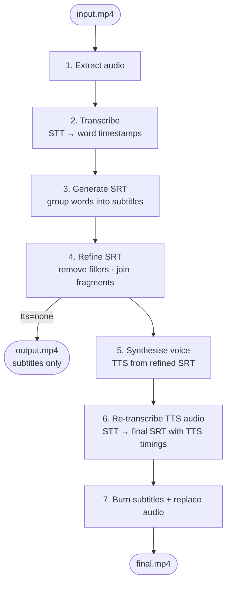

# demo-movier

Pipeline to turn an already-edited demo video into one with **hardcoded subtitles** and optionally a **synthetic voice** replacing the original audio.

```
input.mp4 → transcribe → subtitles → refine → TTS → re-transcribe → burn → replace audio → final.mp4
```

## Pipeline overview



> **Why re-transcribe?** The TTS engine speaks at a different pace than the original recording, so the subtitle timestamps from step 3 would be misaligned. Running STT on the synthesised audio produces a new SRT whose timings are perfectly in sync with the new voice.

## Requirements

- Python 3.12+
- [uv](https://docs.astral.sh/uv/)
- FFmpeg (`brew install ffmpeg-full`)
- A Google Cloud project with **Speech-to-Text** and **Text-to-Speech** APIs enabled

```bash
gcloud services enable speech.googleapis.com texttospeech.googleapis.com \
  --project=YOUR_PROJECT_ID
```

## Setup

```bash
uv sync --all-extras # or choose only the extras that you need
cp .env.example .env
# fill in GOOGLE_CLOUD_PROJECT (and GOOGLE_CLOUD_BUCKET for long videos) in .env
```

Authenticate with Google Cloud:

```bash
gcloud auth application-default login
```

## Usage

### Full pipeline in one command

```bash
uv run movier run demo.mp4
```

This produces `demo.final.mp4` with hardcoded subtitles and a synthetic voice. The refine step runs automatically (LLM backend by default). Add `--keep-intermediates` to also save the `.words.json`, `.srt`, `.refined.srt`, `.tts.mp3`, and `.tts.srt` files.

```bash
uv run movier run demo.mp4 \
  --voice en-US-Chirp3-HD-Aoede \   # newest Google voice
  --refine-backend rules \           # use offline rules instead of LLM
  --color yellow \
  --font-size 24 \
  --keep-intermediates
```

#### Resuming an interrupted run

If the pipeline is interrupted (e.g. a network error during TTS or STT), rerun the same command with `--resume` to pick up from where it stopped:

```bash
uv run movier run demo.mp4 --resume
```

Each step checks whether its output file already exists and skips it if so. The checkpoint files are:

| Step | Checkpoint file |
|---|---|
| 1+2 — extract audio + transcribe | `demo.words.json` |
| 3 — generate SRT | `demo.srt` |
| 4 — refine | `demo.refined.srt` |
| 5 — TTS | `demo.tts.mp3` |
| 6 — re-transcribe TTS audio | `demo.tts.srt` |
| 7 — burn + replace audio | `demo.final.mp4` |

`--resume` implicitly keeps all intermediate files on disk (so checkpoints survive across runs). The files are **not** deleted after a successful run — remove them manually when you no longer need them, or run without `--resume` for a clean single-shot execution.

#### All options

| Option | Default | Values | Description |
|---|---|---|---|
| `--stt` | `google` | `google`, `whisper` | Speech-to-text backend |
| `--tts` | `google` | `google`, `none` | TTS backend; `none` skips voice replacement and only burns subtitles |
| `--voice` | `en-US-Chirp3-HD-Charon` | any Google voice ID | See [Recommended Google voices](#recommended-google-voices) |
| `--language` | `en-US` | BCP-47 tag | Language for STT transcription |
| `--max-words` | `8` | integer | Max words per subtitle block |
| `--font-size` | `22` | integer | Subtitle font size in pixels |
| `--color` | `white` | `white`, `yellow`, `cyan` | Subtitle text colour |
| `--not-timed` | off | flag | Ignore subtitle timestamps; synthesise as one continuous audio file |
| `--respect-silences` | off | flag | In timed mode, preserve actual silence gaps between subtitles (uses per-chunk prosody rates) |
| `--rate` | `1.0` | 0.5–2.0 | Speaking rate for TTS |
| `--refine-backend` | `llm` | `rules`, `llm` | Subtitle refinement: `rules` is offline, `llm` uses Gemini Flash |
| `--resume` | off | flag | Skip steps whose output files already exist |
| `--keep-intermediates` | off | flag | Keep `.words.json`, `.srt`, `.refined.srt`, `.tts.mp3`, `.tts.srt` after the run |
| `-o` / `--output` | `<video>.final.mp4` | path | Final output video path |

### Step by step

**1. Transcribe** — extract audio and get word-level timestamps:

```bash
uv run movier transcribe demo.mp4
# → demo.words.json
```

**2. Generate subtitles** — group words into an SRT file:

```bash
uv run movier subtitles demo.words.json
# or directly from a video:
uv run movier subtitles demo.mp4
# → demo.srt
```

**3. Refine subtitles** — clean up filler words and join mid-sentence fragments:

```bash
uv run movier refine demo.srt
# → demo.refined.srt
```

The refine step improves TTS quality by removing hesitation sounds (`um`, `uh`, `hmm`, …) and boundary fillers (`so,`, `right?`, `you know`). It also joins subtitle segments that end mid-sentence into a single block, which produces more natural-sounding narration.

Two backends are available:

| Backend | Quality | Cost | Notes |
|---|---|---|---|
| `llm` *(default in `run`)* | Best | Gemini Flash via Vertex AI | Requires `GOOGLE_CLOUD_PROJECT` + ADC |
| `rules` | Good | Free | Offline regex-based, no API needed |

**4. Synthesise voice** — generate TTS audio from the refined SRT:

```bash
uv run movier voice demo.refined.srt --voice en-US-Chirp3-HD-Charon --video demo.mp4
# ignore timestamps and synthesise as one continuous file:
uv run movier voice demo.refined.srt --not-timed
# preserve actual silence gaps between subtitles:
uv run movier voice demo.refined.srt --video demo.mp4 --respect-silences
# → demo.refined.tts.mp3
```

**5. Re-transcribe TTS audio** — extract subtitle timings from the synthesised voice:

```bash
uv run movier transcribe demo.refined.tts.mp3
uv run movier subtitles demo.refined.tts.mp3.words.json
# → demo.refined.tts.mp3.srt
```

**6. Burn subtitles** — hardcode the TTS-aligned SRT into the original video:

```bash
uv run movier burn demo.mp4 demo.refined.tts.mp3.srt
# → demo.subtitled.mp4
```

**7. Replace audio**:

```bash
uv run movier replace demo.subtitled.mp4 demo.refined.tts.mp3
# → demo.subtitled.revoiced.mp4

# or mix synthetic voice with original audio at low volume:
uv run movier replace demo.subtitled.mp4 demo.refined.tts.mp3 --mix --original-volume 0.1
```

## STT backends

| Backend | Quality | Cost | Notes |
|---|---|---|---|
| `google` *(default)* | Excellent | ~$0.004/min | Chirp 2 model, auto-chunked for long videos |
| `whisper` | Excellent | Free | Runs locally; install with `uv sync --extra whisper` |

Switch with `--stt whisper` on any command that triggers transcription.

The Google backend automatically splits audio into 55-second chunks, so there is no length limit — long videos work out of the box. The `--gcs-uri` flag is an optional shortcut if you have already uploaded the audio to GCS and want to skip local extraction:

```bash
gsutil cp audio.wav gs://your-bucket/audio.wav
uv run movier transcribe demo.mp4 --gcs-uri gs://your-bucket/audio.wav
```

## TTS backend

The pipeline uses Google Cloud TTS.

#### Long Audio API

Google's synchronous TTS API has a **5000-byte input limit**. For longer transcripts the pipeline automatically falls back to the [Long Audio API](https://cloud.google.com/text-to-speech/docs/create-audio-text-long-audio-synthesis), which writes the result to GCS and downloads it. This requires `GOOGLE_CLOUD_BUCKET` to be set in `.env`.

### Recommended Google voices

| Name | Voice ID | Style |
|---|---|---|
| Studio male | `en-US-Studio-Q` | Clear, neutral |
| Studio female | `en-US-Studio-O` | Clear, neutral |
| Chirp3 HD Aoede | `en-US-Chirp3-HD-Aoede` | Warm female, most natural |
| Chirp3 HD Charon | `en-US-Chirp3-HD-Charon` | Deep male |
| Chirp3 HD Fenrir | `en-US-Chirp3-HD-Fenrir` | Authoritative male |
| Chirp3 HD Kore | `en-US-Chirp3-HD-Kore` | Clear female |

### TTS timing modes

- **timed** *(default)* — each subtitle segment is synthesised and placed at its original timestamp using a two-pass prosody approach; pitch-preserving time-stretching (via `pyrubberband`) corrects any overshoot per chunk
- **timed + respect-silences** (`--respect-silences`) — same as timed, but actual silence gaps between subtitles are preserved in the SSML; per-chunk prosody rates are derived from the gap-inclusive duration
- **full** (`--not-timed`) — entire transcript synthesised as one continuous audio file; simpler but pacing may differ from the original video

## Subtitle customisation

| Option | Default | Notes |
|---|---|---|
| `--max-words` | 8 | Max words per subtitle block |
| `--max-chars` | 60 | Max characters per line |
| `--pause` | 0.6s | Start a new block when silence gap exceeds this |
| `--font-size` | 22 | |
| `--color` | `white` | `white`, `yellow`, or `cyan` |
| `--no-bold` | — | Bold is on by default |
| `--margin-v` | 30px | Distance from the bottom edge |

## Environment variables

| Variable | Required | Description |
|---|---|---|
| `GOOGLE_CLOUD_PROJECT` | Yes (Google STT/TTS/LLM refine) | GCP project ID |
| `GOOGLE_CLOUD_BUCKET` | Yes (Google TTS on long videos) | GCS bucket name used to stage Long Audio API output |
| `GOOGLE_APPLICATION_CREDENTIALS` | No | Path to service account JSON; not needed if using `gcloud auth application-default login` |
